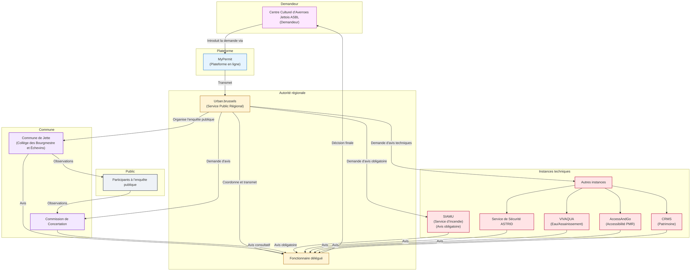

## Schéma des acteurs – Permis d’urbanisme (Bruxelles)

```mermaid
%%{init: {'theme': 'default', 'flowchart': {'useMaxWidth': false, 'htmlLabels': true, 'curve':'basis'}}}%%
flowchart TD
  %% Groupes
  subgraph G0[Demandeur]
    A["Centre Culturel d’Averroes Jettois ASBL<br/>(Demandeur)"]
  end
  subgraph G1[Plateforme]
    M["MyPermit<br/>(Plateforme en ligne)"]
  end
  subgraph G2[Autorité régionale]
    B["Urban.brussels<br/>(Service Public Régional)"]
    C["Fonctionnaire délégué"]
  end
  subgraph G3[Commune]
    D["Commune de Jette<br/>(Collège des Bourgmestre et Échevins)"]
    E["Commission de Concertation"]
  end
  subgraph G4[Instances techniques]
    F["SIAMU<br/>(Service d’Incendie)<br/>(Avis obligatoire)"]
    G["Autres instances"]
    H["Service de Sécurité ASTRID"]
    I["VIVAQUA<br/>(Eau/Assainissement)"]
    J["AccessAndGo<br/>(Accessibilité PMR)"]
    K["CRMS<br/>(Patrimoine)"]
  end
  subgraph G5[Public]
    L["Participants à l’enquête publique"]
  end

  %% Flux
  A -->|Introduit la demande via| M
  M -->|Transmet| B
  B -->|Coordonne et transmet| C
  B -->|Organise l'enquête publique| D
  B -->|Demande d'avis| E
  B -->|Demande d'avis obligatoire| F
  B -->|Demande d'avis techniques| G
  G --> H
  G --> I
  G --> J
  G --> K
  D -->|Avis| C
  D -->|Observations| L
  L -->|Observations| E
  E -->|Avis consultatif| C
  F -->|Avis obligatoire| C
  H -->|Avis| C
  I -->|Avis| C
  J -->|Avis| C
  K -->|Avis| C
  C -->|Décision finale| A

  %% Styles (palette douce et lisible)
  classDef demandeur fill:#fde7ff,stroke:#b14ab9,stroke-width:1.5px;
  classDef plateforme fill:#e6f4ff,stroke:#3182ce,stroke-width:1.5px;
  classDef autorite fill:#fff4d6,stroke:#b7791f,stroke-width:1.5px;
  classDef commune fill:#f3e8ff,stroke:#7e22ce,stroke-width:1.5px;
  classDef technique fill:#ffe4e6,stroke:#be123c,stroke-width:1.5px;
  classDef public fill:#eef2f7,stroke:#374151,stroke-width:1.5px;

  class A demandeur;
  class M plateforme;
  class B,C autorite;
  class D,E commune;
  class F,G,H,I,J,K technique;
  class L public;

```
